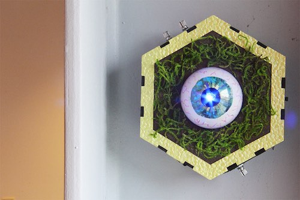

# Autonomous Audio-Reactive Robots (AARR) Arduino Code & Circuits
---
Two Arduino robot designs that actuate a single DC motor or servo in response to sound.

Prototypes have been fabricated and used for the creation of a robotic sound installation:
http://scott-tooby.com/sonic-automata.html

## Arduino Board
Pro Mini 328 - 3.3V/8MHz

Requires FTDI Driver:
- http://www.ftdichip.com/FTDrivers.htm
- https://learn.sparkfun.com/tutorials/how-to-install-ftdi-drivers/

## Circuit Components
See the included breadboard diagrams for an overview of the circuit assembly.

* Arduino Pro Mini 328 - 3.3V
* [Electret mic](https://www.adafruit.com/products/1063)
* Diffused RGB LED (common cathode)
* Resistors (see circuit diagrams)
* (3x) 10kΩ Rotary Potentiometer (linear)
* SPDT Power Switch
* Push button
* Schottky Diode
* 3V Vibrating DC Motor (for MotorBot only)
	- The exact motor model I've used is no longer made by the manufacturer, but [this](https://www.precisionmicrodrives.com/product/312-004-12mm-vibration-motor-20mm-type)
	is a very similar model. Of course you can always adapt this circuit and power supply
	to work with a DC motor of your choosing.
* [Micro servo](https://www.adafruit.com/products/169) (for ServoBot only)
* 3.7V 1200mAh lipo battery

## OPERATING INSTRUCTIONS:
Once you've successfully assembled the AARR circuit and powered it on, you will need to 
step through a few configuration stages to fully activate the robot. See code comments for
more details.

### MotorBot:
The MotorBot code is designed to trigger various rhythmic pulse sequences with a motor
whenever a sound is detected.

1. Set the LED color:
	- Use the three potentiometers to adjust the LED color that will be displayed when
	the motor is active during operation.
	- Press the push button to advance to the next configuration step.

2. Set the maximum motor amplitude:
	- Use the third potentiometer connected to 'pot3Pin' (pin A2)
	to set the maximum amplitude you'd like the motor to achieve during operation.
	- Press the push button once complete.

3. Set the robot's pulse rate:
	- Use the second potentiometer connected to 'pot2Pin' (pin A1) to adjust the average
	rate at which the robot will pulse its motor when active.
	- Press the push button once complete.

4. Set sound sensitivity threshold:
	- Use the first potentiometer connected to 'pot1Pin' (pin A0) to adjust the minimum
	detection threshold of the sound sensor.  The LED will illuminate whenever a sound 
	exceeding this volume threshold is made as an indicator.
	- Press the push button once complete.
	
5. Performance Mode (Pulse) Active:
	- The robot is now in its active 'performance mode.'  It will emit various sequences
	of rhythmic pulses whenever its sound sensor detects a sound above the set threshold.
	- The potentiometers can optionally be adjusted during this time to fine-tune the
	sound sensitivity threshold, rate, and max motor amplitude settings.
	- Press the push button once to advance to an alternative performance mode.
	
6. Performance Mode (Sustain) Active:
	- The robot will activate its motor for varying sustained durations of time whenever
	the sound sensor detects a sound above the set threshold.
	- Press the push button once to exit performance mode and loop back to Step #1.

### ServoBot:
The ServoBot code is designed to trigger servo movement only after an extended period of
silence is detected.

1. Set the LED color:
	- Use the three potentiometers to adjust the LED color that will be displayed when
	the servo is active during operation.
	- Press the push button to advance to the next configuration step. 
	
2. Set servo arm maximum position:
	- Use the third potentiometer connected to 'pot3Pin' (pin A2) to set the maximum
	degree position the servo arm will achieve during operation.
	- Press the push button once complete.
	
3. Test servo arm action and adjust rate:
	- The servo arm will become active and rotate between the minimum and maximum range settings.
	Use the second potentiometer connected to 'pot2Pin' (pin A1) to adjust the rate of the
	servo movement.
	- You can optionally adjust the maximum servo range with the third potentiometer at this
	time too.
	- Press the push button once complete.
 
4. Set silence monitor duration:
	- Use the first potentiometer connected to 'pot1Pin' (pin A0) to set the minimum time
	duration of silence required to trigger servo movement (i.e. the minimum amount of time
	to monitor for sound before triggering the servo)
	- The LED will flash once at the start of the monitoring period as an indicator.
	- Press the push button once complete.
	
5. Set sound sensitivity threshold:
	- Use the first potentiometer connected to 'pot1Pin' (pin A0) to adjust the minimum
	detection threshold of the sound sensor.  The LED will illuminate whenever a sound 
	exceeding this volume threshold is made as an indicator.
	- Press the push button once complete.
	
6. Performance Mode Active:
	- During performance mode, the ServoBot will continuously monitor its sound sensor.
	If no sound is detected after the duration of time configured in Step #4, the servo movement
	will activate.  Alternatively, if continuous sound is detected for an extended period of time,
	the servo will engage a different motion pattern.
	- The potentiometers can optionally be adjusted during this time to fine-tune the
	sound sensitivity threshold, rate, and max servo degree settings.
	- Press the push button once to exit performance mode and loop back to Step #1.

---
This is not an active project at the moment, but may be revisited and augmented
in the future for use in new sound installation and/or instrument design projects.

It's worth mentioning that this circuit can be wirelessly controlled by connecting a
Bluetooth transceiver ([like the RN-42](https://www.sparkfun.com/products/12576)) to the
FTDI pins of the Arduino Pro Mini.  This is what I did for [another robot project](http://www.instructables.com/id/Musical-Melodyian-MIDI-Robot/)
that used a similar circuit.

If you use the circuit or code for your own project, I'd love to hear about it: scott(dot)tooby(at)gmail(dot)com

st, 2016